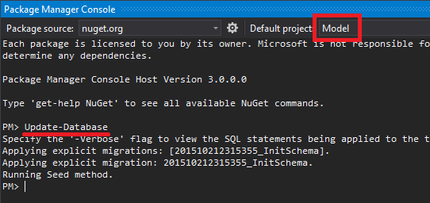
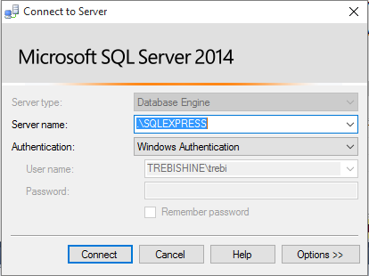
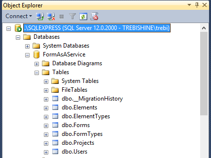

# Form As A Service

## Setup

### Build and run project

1. Install SQL Express (http://www.microsoft.com/en-us/download/details.aspx?id=42299)
	- *Express 64BIT\SQLEXPR_x64_ENU.exe* for 64-bit system
	- *Express 32BIT\SQLEXPR_x86_ENU.exe* for 32-bit system 
2. Build Solution [`F6`], all dependencies should be installed automatically
3. Load Migrations and Seed. With default project `Model` selected, run command `Update-Database` in *Package Manager Console (Tools -> NuGet Package Manager -> Package Manager Console)*

4. Run Application, it should print out database content in *Json* format.

### Connect to database

1. Download *Microsoft SQL Server Management Studio* from http://www.microsoft.com/en-us/download/details.aspx?id=42299  
	- *MgmtStudio 64BIT\SQLManagementStudio_x64_ENU.exe* for 64-bit system
	- *MgmtStudio 32BIT\SQLManagementStudio_x86_ENU.exe* for 32-bit system 
1. Start *Microsoft SQL Server Management Studio*, in *Object Explorer*, click *Connect -> Database Engine* and write `.\SQLEXPRESS` to *Server Name* field.

3. You should see `FormAsAService` database like on a image below.

	